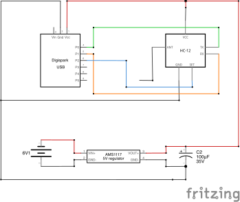
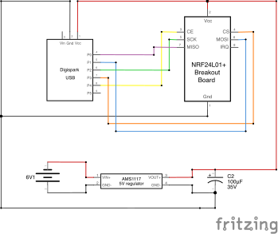
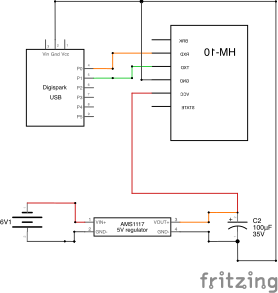
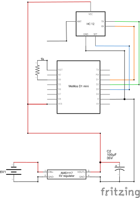
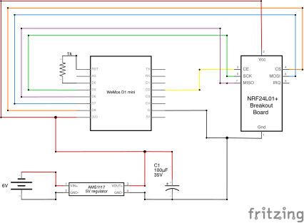
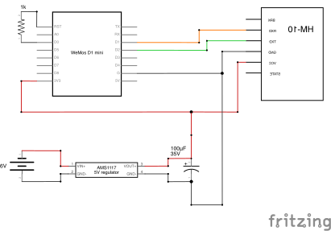
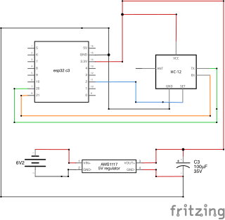
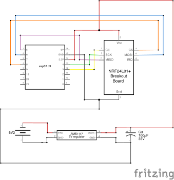

# RF-Based Parcel Tracking System

Low-cost tracking modules for parcel delivery using 433MHz, 2.4GHz nRF24L01+, and BLE protocols.

---

## Table of Contents

1. [Overview](#overview)
2. [Hardware Configurations](#hardware-configurations)
   - [Transmitter Options](#transmitter-options)
   - [Receiver (Base Station)](#receiver-base-station)
3. [Wiring Diagrams](#wiring-diagrams)
   - [ATtiny85 Configurations](#attiny85-configurations)
   - [ESP8266 Configurations](#esp8266-configurations)
   - [ESP32-C3 Configurations](#esp32-c3-configurations)
   - [Receiver Wiring (Raspberry Pi 5)](#receiver-wiring-raspberry-pi-5)
4. [Software Requirements](#software-requirements)
5. [Installation](#installation)
   - [Base Station Setup](#base-station-setup)
   - [Transmitter Setup](#transmitter-setup)
6. [Usage](#usage)
   - [Running the Base Station](#running-the-base-station)
   - [Flashing Transmitters](#flashing-transmitters)
7. [Project Structure](#project-structure)
8. [License](#license)

---

## Overview

This project is a research implementation comparing different RF technologies for parcel tracking in delivery vehicles. The system consists of:

- **Tracking Modules (Transmitters)**: Battery-powered devices attached to parcels that broadcast beacon signals
- **Base Station (Receiver)**: A Raspberry Pi-based system in the delivery vehicle that handles tracking modules and monitors their beacon signals

The project evaluates three different RF protocols:
- **HC-12 (433MHz)**: Long-range wireless serial communication
- **nRF24L01+ (2.4GHz)**: 2.4GHz wireless transceiver
- **HM-10 (BLE 4.0)**: Bluetooth Low Energy

Each configuration is tested with different microcontroller platforms to compare power consumption, range, and reliability.

---

## Hardware Configurations

### Transmitter Options

**Microcontrollers**:
- ATtiny85
- ESP8266
- ESP32-C3

**RF Modules**:
- HC-12 (433MHz)
- nRF24L01+ (2.4GHz)
- HM-10 (BLE 4.0)

### Receiver (Base Station)

**Platform**: Raspberry Pi 5 with protocol-specific RF module(s)

---

## Wiring Diagrams

Complete wiring schematics for all hardware configurations are provided below.

### ATtiny85 Configurations

**Note**: ATtiny85 can be run at 3.3V if downclocked to 8MHz so it works better with the rest of the hardware.
#### ATtiny85 + HC-12 (433MHz)


| ATtiny85 Pin | HC-12 Pin | Notes |
|--------------|-----------|-------|
| VCC | VCC | 3.3-5V |
| GND | GND | Ground |
| PB0 (TX) | RXD | Serial TX |
| PB1 (RX) | TXD | Serial RX |

#### ATtiny85 + nRF24L01+


| ATtiny85 Pin | nRF24L01+ Pin | Notes |
|--------------|---------------|-------|
| VCC | VCC | 3.3V only |
| GND | GND | Ground |
| PB0 | MOSI | SPI Data |
| PB1 | MISO | SPI Data |
| PB2 | SCK | SPI Clock |
| PB3 | CE | Chip Enable |
| PB4 | CSN | Chip Select |

#### ATtiny85 + HM-10 (BLE)


| ATtiny85 Pin | HM-10 Pin | Notes |
|--------------|-----------|-------|
| VCC | VCC | 3.3V |
| GND | GND | Ground |
| PB0 (TX) | RXD | Serial TX |
| PB1 (RX) | TXD | Serial RX |

### ESP8266 Configurations

#### ESP8266 + HC-12 (433MHz)


| ESP8266 Pin | HC-12 Pin | Notes |
|-------------|-----------|-------|
| 3V3 | VCC | 3.3V power |
| GND | GND | Ground |
| TX | RXD | Serial TX |
| RX | TXD | Serial RX |

#### ESP8266 + nRF24L01+


| ESP8266 Pin | nRF24L01+ Pin | Notes |
|-------------|---------------|-------|
| 3V3 | VCC | 3.3V only |
| GND | GND | Ground |
| D7 | MOSI | SPI Data |
| D6 | MISO | SPI Data |
| D5 | SCK | SPI Clock |
| D4 | CE | Chip Enable |
| D8 | CSN | Chip Select |

#### ESP8266 + HM-10 (BLE)


| ESP8266 Pin | HM-10 Pin | Notes |
|-------------|-----------|-------|
| 3V3 | VCC | 3.3V |
| GND | GND | Ground |
| TX | RXD | Serial TX |
| RX | TXD | Serial RX |

### ESP32-C3 Configurations

#### ESP32-C3 + HC-12 (433MHz)


| ESP32-C3 Pin | HC-12 Pin | Notes |
|--------------|-----------|-------|
| 3V3 | VCC | 3.3V power |
| GND | GND | Ground |
| GPIO21 (TX) | RXD | Serial TX |
| GPIO20 (RX) | TXD | Serial RX |

#### ESP32-C3 + nRF24L01+


| ESP32-C3 Pin | nRF24L01+ Pin | Notes |
|--------------|---------------|-------|
| 3V3 | VCC | 3.3V only |
| GND | GND | Ground |
| GPIO7 | MOSI | SPI Data |
| GPIO2 | MISO | SPI Data |
| GPIO6 | SCK | SPI Clock |
| GPIO10 | CE | Chip Enable |
| GPIO3 | CSN | Chip Select |

---

## Receiver Wiring (Raspberry Pi 5)

### Raspberry Pi 5 + HC-12 (433MHz)

| Raspberry Pi 5 Pin | HC-12 Pin | Notes |
|--------------------|-----------|-------|
| Pin 2 (5V) | VCC | 5V power |
| Pin 6 (GND) | GND | Ground |
| Pin 8 (GPIO14 TX) | RXD | UART transmit |
| Pin 10 (GPIO15 RX) | TXD | UART receive |

### Raspberry Pi 5 + nRF24L01+

| Raspberry Pi 5 Pin | nRF24L01+ Pin | Notes |
|--------------------|---------------|-------|
| Pin 1 (3.3V) | VCC | 3.3V only! |
| Pin 6 (GND) | GND | Ground |
| Pin 19 (GPIO10 MOSI) | MOSI | SPI data out |
| Pin 21 (GPIO9 MISO) | MISO | SPI data in |
| Pin 23 (GPIO11 SCLK) | SCK | SPI clock |
| Pin 24 (GPIO8 CE0) | CSN | Chip select |
| Pin 22 (GPIO25) | CE | Chip enable |

### Raspberry Pi + HM-10 (BLE)

| Raspberry Pi 5 Pin | HM-10 Pin | Notes |
|--------------------|-----------|-------|
| Pin 1 (3.3V) | VCC | 3.3V power |
| Pin 6 (GND) | GND | Ground |
| Pin 8 (GPIO14 TX) | RXD | UART transmit |
| Pin 10 (GPIO15 RX) | TXD | UART receive |

**Alternative**: The Raspberry Pi 5 has builtin Bluetooth, can communicate with HM-10 modules using BLE directly.

---

## Software Requirements

### Base Station (Raspberry Pi)

- **Python**: 3.9 or higher
- **Required Libraries**:
  - `pyserial` - Serial communication for HC-12 and HM-10
  - `spidev` - SPI communication for nRF24L01+
  - `lgpio` - GPIO control on Raspberry Pi 5
  - `bleak` - Bluetooth Low Energy communication

Install all dependencies:
```bash
pip install pyserial spidev lgpio bleak
```

### Transmitters

- **Arduino IDE**: Version 1.8.x or 2.x
- **Board Support**:
  - ATtiny85: ATtiny board support (via Board Manager)
  - ESP8266: ESP8266 board support (via Board Manager)
  - ESP32-C3: ESP32 board support (via Board Manager)
- **Libraries**:
  - `RF24` library for nRF24L01+ configurations
  - `SoftwareSerial` for ATtiny85 serial communication

---

## Installation

### Base Station Setup

1. **Hardware Assembly**
   - Connect your chosen RF module(s) to the Raspberry Pi GPIO pins
   - See the receiver pinout tables

2. **Software Installation**
   ```bash
   git clone https://github.com/yourusername/ba-parcel-tracker.git
   cd ba-parcel-tracker/basestation
   pip install pyserial spidev lgpio bleak
   ```

3. **Configuration**
   - Edit the receiver script to match your RF module configuration
   - Set appropriate serial ports and GPIO pins if needed

### Transmitter Setup

1. **Install Arduino IDE**
   - Add board support for your microcontroller platform

2. **Install Required Libraries**
   - For nRF24L01+: Install `RF24` library via Library Manager
   - Other dependencies are included with board support packages

3. **Select Configuration**
   - Choose the subfolder matching your hardware (e.g., `esp8266/nrf24/`)

---

## Usage

### Running the Base Station

Start the base station receiver with a unique station ID:

#### HC-12 Receiver
```bash
python basestation/hc12_receiver.py 1
```

#### nRF24L01+ Receiver
```bash
python basestation/nrf24_receiver.py 1
```

#### BLE Receiver
```bash
python basestation/ble_receiver.py 1
```

The station ID is used to distinguish if there are multiple base stations

**Expected Output**:
- The receiver will listen for beacon signals
- Tracking data is logged to console

### Flashing Transmitters

1. Open Arduino IDE
2. Select correct Board and Port
3. Upload code and flash
---

## Project Structure

```
ba-parcel-tracker/
├── basestation/            # Base station receiver code
│   ├── hc12_receiver.py
│   ├── nrf24_receiver.py
│   ├── ble_receiver.py
│   └── logs/
├── transmitter/            # Transmitter firmware
│   ├── common/
│   │   └── beacon.h
│   ├── attiny85/
│   │   ├── hc12/
│   │   ├── nrf24/
│   │   └── ble-hm10/
│   ├── esp8266/
│   │   ├── hc12/
│   │   ├── nrf24/
│   │   └── ble-hm10/
│   └── esp32c3/
│       ├── hc12/
│       ├── nrf24/
│       └── ble-native/
├── schematics/             # Wiring diagrams
│   ├── attiny85_hc_12.png
│   ├── attiny85_nrf24l01.png
│   ├── attiny85_hm_10.png
│   ├── esp8266_hc12.png
│   ├── esp8266_nrf24l01.png
│   ├── esp8226_hm-10.png
│   ├── esp32c3_hc12.png
│   └── esp32c3_nrf24l01.png
└── README.md
```

---

### Communication Protocols

Each RF technology uses a different approach:
- **HC-12**: UART serial communication
- **nRF24L01+**: SPI-based wireless communication
- **HM-10 BLE**: Bluetooth Low Energy advertising

---

## License

MIT License - see [LICENSE](LICENSE) file for details.

This project is part of the implementation of a bachelor's thesis on RF-based parcel tracking systems.